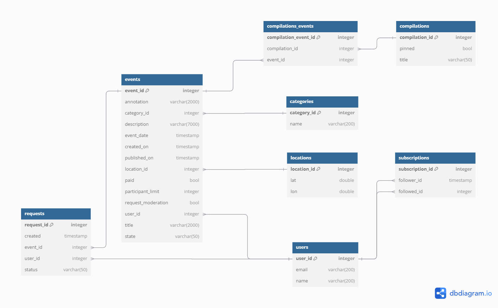
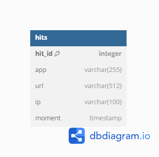

# :soccer: java-explore-with-me :dancer:
## Сервис поиска интересных событий :mag:
_______

## <a id="up" />Навигация

### :black_nib:[Описание](#description)
### :triangular_ruler: [Стек технологий](#stack)  
### :roller_coaster: [Главный сервис (main)](#main-service)  
- [архитектура базы данных (main)](#architecture)
- [энпоинты (main)](#endpoints)
### :chart_with_upwards_trend: [Сервис статистики (stats)](#stats-service)  
- [архитектура базы данных (stats)](#architecture)
- [энпоинты (stats)](#endpoints)
### :snail: [Планы](#plans)

___
## :black_nib: <a id="description" />Описание

Приложение позволяет организовать собственные события и узнать о чужих.
Сервис предоставляет группы функциональностей:
- открытая (получение информации о конкретном или группе событий, категориях событий и их подборках)  
- административная (публикация, удаление и получение перечня всех пользователей и категорий,
  модерация событий и их подборок)  
- для зарегистрированных пользователей (получение более подробной информации о событиях и их подборках,
  возможность оставить запрос на участие в событии)  

В приложении реализовано 2 сервиса: 
- **главный**([main](#main-service)), где сосредоточена вся бизнес-логика,  
- **сервис сбора статистических данных**([stats](#stats-service)).  
Оба сервиса развернуты на разных виртуальных машинах 
с помощью утилиты контейнеризации Docker, каждый из них взаимодействует с отдельной реляционной
базой данных(СУБД - PostgreSQL), которые также развернуты на отдельных виртуальных машинах(см [docker-compose](docker-compose.yml)). 
Взаимодействие между сервисами реализовано с помощью протокола HTTP. В момент обращения пользователя к эндпоинту в основном сервисе вызывается метод клиента, находящийся в
сервисе статистики, который в свою очередь с помощью HTTP-запроса отправляет на контроллер сервиса статистики запрос
о сохранении или получении информации о запросах к текущему эндпоинту основного сервиса.  

[Навигация](#up)
___
## :triangular_ruler: <a id="stack" />Стек технологий
- Java 21  
- Spring Boot 3  
- Mapstruct  
- Lombok  
- Slf4j  
- PostgreSQL   
- Jakarta validation  
- Maven  
- Hibernate ORM  
- Docker  
- Swagger  
- Git
  
[Навигация](#up)
___

## :roller_coaster: <a id="main-service" />ГЛАВНЫЙ СЕРВИС (MAIN)
___
### <a id="endpoints" />ЭНДПОИНТЫ (MAIN)

### **Открытые**
#### _Категории событий_
`GET   /categories` - получение категорий.  
`GET   /categories/{catId}` - получение информации о категории по её id.

#### _События_
`GET   /events` - получение событий с возможностью фильтрации.  
`GET   /events/{id}` - получение подробной информации об опубликованном событии по его id.

#### _Подборки событий_
`GET   /compilations` - получение подборок событий.  
`GET   /compilations/{compId}` - получение подборки событий по его id.

#### _Подписки на других пользователей_
`POST   /subscriptions/follower/{followerId}/followed/{followedId}` - оформление подписки пользователем с id = followerId на пользователя с id = followedId.  
`DELETE   /subscriptions/follower/{followerId}/followed/{followedId}` - отмена подписки пользователем с id = followerId на пользователя с id = followedId.  
`GET   /subscriptions/follower/{followerId}` - получение списка событий пользователей, на которых подписан пользователь с id = followerId.  

### **Административные**
#### _Категории_
`POST   /admin/categories` - добавление новой категории.  
`DELETE   /admin/categories/{catId}` - удаление категории.  
`PATCH   /admin/categories/{catId}` - изменение категории.

#### _События_
`GET   /admin/events` - поиск событий.  
`PATCH   /admin/events/{eventId}` - редактирование данных события и его статуса (отклонение/публикация).

#### _Пользователи_
`GET   /admin/users` - получение информации о пользователях.  
`POST   /admin/users` - добавление нового пользователя.  
`DELETE   /admin/users/{userId}`- удаление пользователя.

#### _Подборки событий_
`POST   /admin/compilations` - добавление новой подборки(подборка может не содержать событий).  
`DELETE   /admin/compilations/{compId}` - удаление подборки.  
`PATCH   /admin/compilations/{compId}` - обновить информацию о подборке.

### **Для авторизованных пользователей**
#### _События_
`GET   /users/{userId}/events` - получение событий, добавленных текущим пользователем.  
`POST   /users/{userId}/events` - добавление нового события.  
`GET   /users/{userId}/events/{eventId}` - получение полной информации о событии, добавленном текущим пользователем.  
`PATCH /users/{userId}/events/{eventId}` - изменение события, добавленного текущим пользователем.  
`GET   /users/{userId}/events/{eventId}/requests` - получение запросов на участие в событии текущего пользователя.  
`PATCH /users/{userId}/events/{eventId}/requests` - изменение статуса(подтверждена, отменена) заявок на участие в событии текущего пользователя.

#### _Запросы на участие в событии_
`GET   /users/{userId}/requests` - получение информации о заявках текущего пользователя на участие в чужих событиях.  
`POST   /users/{userId}/requests` - добавление запроса от текущего пользователя на участие в событии.  
`PATCH   /users/{userId}/requests/{requestId}/cancel` - отмена своего запроса на участие в событии.  

[Навигация](#up)
___
### <a id="architecture" />АРХИТЕКТУРА БАЗЫ ДАННЫХ (MAIN)

Схема таблиц реляционной базы данных основного сервиса

### Описание таблиц:
  
***events***

Содержит данные об отдельных событиях. Данные преобразуются в центральную сущность приложения - событие, 
вокруг которой выстроены все прочие.
Таблица включает поля:

| название             | тип поля                    | описание                                        | ограничение                                                       |
|----------------------|-----------------------------|-------------------------------------------------|-------------------------------------------------------------------|
| `event_id`           | BIGINT                      | идентификатор события                           | PRIMARY KEY, NOT NULL                                             |
| `annotation`         | VARCHAR(2000)               | аннотация для события                           | -                                                                 |
| `description`        | VARCHAR(7000)               | описание события                                | NOT NULL                                                          |
| `title`              | VARCHAR(2000)               | название события                                | NOT NULL                                                          |
| `state`              | VARCHAR(50)                 | состояние события                               | -                                                                 |
| `event_date`         | TIMESTAMP WITHOUT TIME ZONE | дата проведения события                         | NOT NULL                                                          |
| `created_on`         | TIMESTAMP WITHOUT TIME ZONE | дата создания события                           | -                                                                 |
| `published_on`       | TIMESTAMP WITHOUT TIME ZONE | дата публикации события                         | -                                                                 |
| `paid`               | BOOLEAN                     | флаг наличия платы за вход на события           | NOT NULL                                                          |
| `request_moderation` | BOOLEAN                     | флаг необходимости проведения модерации события | -                                                                 |
| `participant_limit`  | INTEGER                     | максимальное количество участников события      | -                                                                 |
| `category_id`        | BIGINT                      | идентификатор категории события                 | FOREIGN KEY (category_id) REFERENCES categories ON DELETE CASCADE |
| `location_id`        | BIGINT                      | идентификатор местоположения проведения события | FOREIGN KEY (location_id) REFERENCES locations ON DELETE CASCADE  |
| `user_id`            | BIGINT                      | идентификатор пользователя приложения           | FOREIGN KEY (user_id) REFERENCES users ON DELETE CASCADE          |

***requests***

Содержит данные о запросах на участие в событиях.
Таблица включает поля:

| название      | тип поля                    | описание                                     | ограничение                                                |
|---------------|-----------------------------|----------------------------------------------|------------------------------------------------------------|
| `request_id`  | BIGINT                      | идентификатор запроса на участие в событии   | PRIMARY KEY, NOT NULL                                      |
| `created`     | TIMESTAMP WITHOUT TIME ZONE | момент создания запроса                      | -                                                          |
| `status`      | VARCHAR(50)                 | статус запроса                               | -                                                          |
| `event_id`    | BIGINT                      | идентификатор события                        | FOREIGN KEY (event_id) REFERENCES events ON DELETE CASCADE |
| `user_id`     | BIGINT                      | идентификатор пользователя приложения        | FOREIGN KEY (user_id) REFERENCES users ON DELETE CASCADE   |

***categories***

Содержит данные о категориях событий.
Таблица включает поля:

| название       | тип поля    | описание                         | ограничение            |
|----------------|-------------|----------------------------------|------------------------|
| `category_id`  | BIGINT      | идентификатор категории события  | PRIMARY KEY, NOT NULL  |
| `name`         | VARCHAR(50) | наименование категории           | NOT NULL, UNIQUE       |

***locations***

Содержит данные о местоположениях для проведения событий.
Таблица включает поля:

| название        | тип поля    | описание                       | ограничение            |
|-----------------|-------------|--------------------------------|------------------------|
| `location_id`   | BIGINT      | идентификатор местоположения   | PRIMARY KEY, NOT NULL  |
| `lat`           | FLOAT       | широта                         | NOT NULL               |
| `lon`           | FLOAT       | долгота                        | NOT NULL               |

***users***

Содержит данные об отдельных пользователях.
Таблица включает такие поля:

| название   | тип поля     | описание                             | ограничение             |
|------------|--------------|--------------------------------------|-------------------------|
| `user_id`  | BIGINT       | идентификатор пользователя           | PRIMARY KEY, NOT NULL   |
| `name`     | VARCHAR(256) | имя пользователя                     | NOT NULL                |
| `email`    | VARCHAR(256) | адрес электронной почты пользователя | NOT NULL, UNIQUE        |

***subscriptions***

Содержит данные об подписках пользователей друг на друга.
Таблица включает такие поля:

| название             | тип поля         | описание                                            | ограничение                                              |
|----------------------|------------------|-----------------------------------------------------|----------------------------------------------------------|
| `subscription_id`    | BIGINT           | идентификатор подписки                              | PRIMARY KEY, NOT NULL                                    |
| `follower_id`        | BIGINT           | идентификатор подписавшегося пользователя           | FOREIGN KEY (user_id) REFERENCES users ON DELETE CASCADE |
| `followed_id`        | BIGINT           | идентификатор пользователя, на которого подписались | FOREIGN KEY (user_id) REFERENCES users ON DELETE CASCADE |

***compilations***

Содержит данные об подборках событий.
Таблица включает такие поля:

| название           | тип поля     | описание                          | ограничение           |
|--------------------|--------------|-----------------------------------|-----------------------|
| `compilation_id`   | BIGINT       | идентификатор подборки событий    | PRIMARY KEY, NOT NULL |
| `pinned`           | BOOLEAN      | флаг закрепленности               | -                     |
| `title`            | VARCHAR(50)  | наименование подборки             | NOT NULL              |

***compilations_events***

Таблица-связка, содержит данные о парах событие-подборка, поскольку одно событие может содержаться в нескольких
подборках и наоборот.
Таблица включает такие поля:

| название                 | тип поля      | описание                            | ограничение                                                            |
|--------------------------|---------------|-------------------------------------|------------------------------------------------------------------------|
| `compilation_event_id`   | BIGINT        | идентификатор пары                  | PRIMARY KEY, NOT NULL                                                  |
| `compilation_id`         | BIGINT        | идентификатор подборки              | FOREIGN KEY (compilation_id) REFERENCES compilations ON DELETE CASCADE |
| `event_id`               | BIGINT        | идентификатор события               | FOREIGN KEY (event_id) REFERENCES events ON DELETE CASCADE             |

[Навигация](#up)

___

## :chart_with_upwards_trend: <a id="stats-service" />СЕРВИС СТАТИСТИКИ (STATS)
___

### <a id="endpoints" />ЭНДПОИНТЫ (STATS)
`POST /hit` - добавление информации о просмотре конкретным пользователем конкретного события(обращение к эндпоинту).  
`GET /stats` - получение статистики запросов к переданным в параметрах запроса эндпоинтам основного сервиса.  

[Навигация](#up)
___

### <a id="architecture" />АРХИТЕКТУРА БАЗЫ ДАННЫХ (STATS)
Схема таблиц реляционной базы данных сервиса статистики  

### Описание таблиц:
***hits***

Содержит данные о запросах пользователей к конкретным эндпоинтам основного сервиса.
Таблица включает поля:

| название    | тип поля                    | описание                                                          | ограничение           |
|-------------|-----------------------------|-------------------------------------------------------------------|-----------------------|
| `hit_id`    | BIGINT                      | идентификатор обращения к эндпоинту                               | PRIMARY KEY, NOT NULL |
| `app`       | VARCHAR(255)                | наименование сервиса, из которого происходит обращение            | NOT NULL              |
| `url`       | VARCHAR(512)                | url соответствующего эндпоинта                                    | NOT NULL              |
| `ip`        | VARCHAR(100)                | адрес компьютера пользователя в сети Internet                     | NOT NULL              |
| `moment`    | TIMESTAMP WITHOUT TIME ZONE | момент времени, в который было осуществлено обращение к эндпоинту | -                     |

[Навигация](#up)

___
## :snail: <a id="plans" />Планы
- комментарии к событиям;
- лайки/дизлайки, рейтинг мероприятий;
- администрирование локаций;
- модерация событий администратором.

[Навигация](#up)